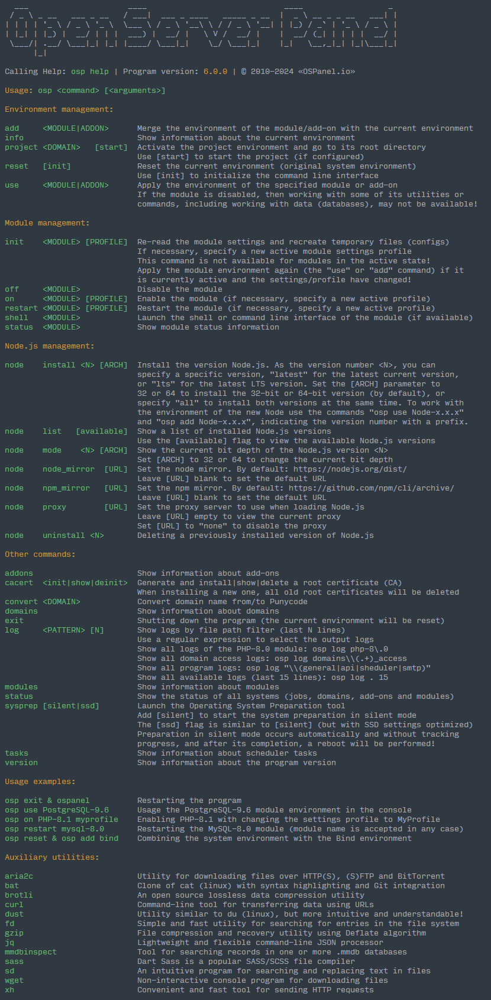
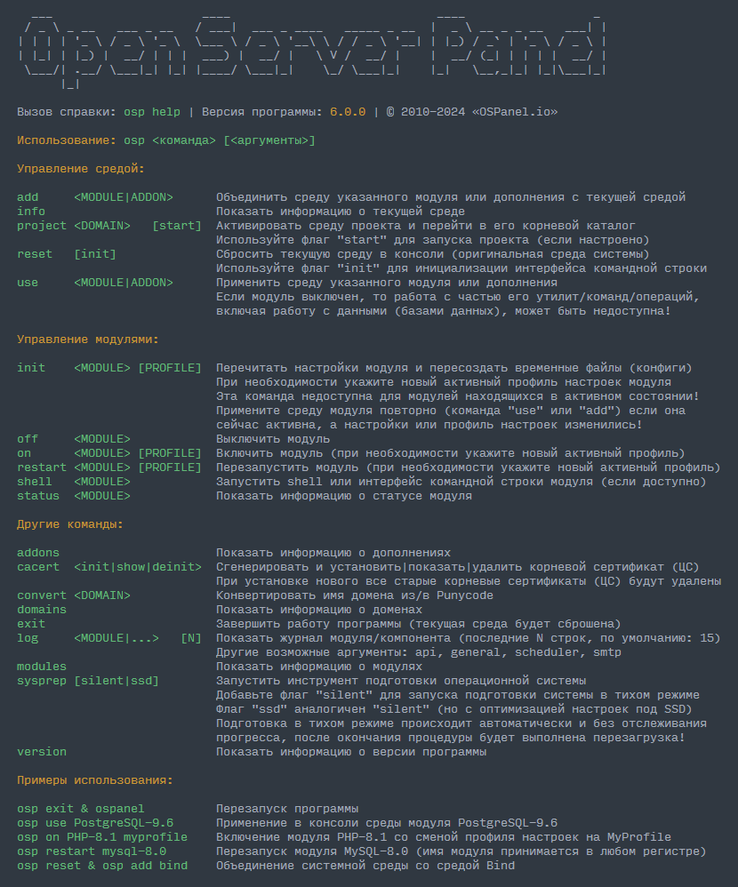

Open Server Panel 6 Beta
=======================================
                

**PHPINFO:** [PHP 7.2](https://ospanel.io/phpinfo/php72.html) | [PHP 7.3](https://ospanel.io/phpinfo/php73.html) | [PHP 7.4](https://ospanel.io/phpinfo/php74.html) | [PHP 8.0](https://ospanel.io/phpinfo/php80.html) | [PHP 8.1](https://ospanel.io/phpinfo/php81.html) | [PHP 8.2](https://ospanel.io/phpinfo/php82.html) | [PHP 8.3](https://ospanel.io/phpinfo/php83.html)

We present you the best software environment for web development!

Open Server Panel is a unique tool for local development of websites and web services on the Windows platform. It offers a large set of server software (WAMP stack), as well as a simple and convenient control panel.

Today, the Open Server Panel is widely used for the purpose of developing, debugging and testing web projects, as well as for providing web services on local networks. The project has gained great popularity among novice web developers, as it allows you to quickly deploy a work environment and immediately start learning web technologies without complex manipulations for installing and configuring a variety of software.

**Features**

- Unobtrusive work in the Windows tray
- Multilingual interface
- Support portable operation mode
- Full user access to module settings and configurations
- Program management in console mode and via the web interface (under development)
- Full control over processes (including monitoring and recovery after a failure)
- The possibility of parallel operation of any modules (you can enable all at the same time)
- Easy domain management with support for internationalized domains and domain pseudomains (aliases)
- A huge set of third-party PHP extensions
- SSL and IPv6 support without additional configuration
- The ability to quickly change the current environment in the console with one command
- Ability to create module configuration profiles (including module configuration files and data)
- Personalization of settings for each domain (from IP to PHP version)
- A pre-configured environment for each module (up to entering the shell/cli with one command)
- Punycode domain name converter
- and much more...

[Documentation](https://github.com/OSPanel/OpenServerPanel/wiki/Home)

**Download**

https://files.ospanel.io/ospanel_setup_6_0_0_570.exe 
https://us.ospanel.io/ospanel_setup_6_0_0_570.exe 
https://eu.ospanel.io/ospanel_setup_6_0_0_570.exe

Command Line Interface
----------

***

Представляем вам лучшую программную среду для веб-разработки!

Open Server Panel — уникальный инструмент для локальной разработки веб-сайтов и веб-сервисов на платформе Windows. К вашим услугам большой набор серверного программного обеспечения ([WAMP](https://ru.wikipedia.org/wiki/WAMP)-cтек), а также простая и удобная панель управления.

На сегодняшний день Open Server Panel широко используется с целью разработки, отладки и тестирования веб-проектов, а также для предоставления веб-сервисов в локальных сетях. Проект завоевал большую популярность у начинающих веб-разработчиков, так как позволяет быстро развернуть рабочую среду и сразу начать изучение веб-технологий без сложных манипуляций по установке и настройке разнообразного ПО.

**Скачать**

https://files.ospanel.io/ospanel_setup_6_0_0_570.exe 
https://us.ospanel.io/ospanel_setup_6_0_0_570.exe 
https://eu.ospanel.io/ospanel_setup_6_0_0_570.exe

**Возможности**

- Незаметная работа в трее Windows
- Мультиязычный интерфейс
- Поддержка портативного режима работы
- Полный доступ пользователя к настройкам и конфигурации модулей
- Управление программой в консольном режиме и через веб-интерфейс (в разработке)
- Полный контроль над процессами (включая мониторинг и восстановление после сбоя)
- Возможность параллельной работы любых модулей (можно включить все одновременно)
- Простое управление доменами с поддержкой интернационализованных доменов и доменных псевдоминов (алиасов)
- Огромный набор сторонних расширений PHP
- Поддержка SSL и IPv6 без дополнительной настройки
- Возможность быстрой смены текущей среды в консоли одной командой
- Возможность создавать профили настроек модулей (включая файлы конфигурации модулей и данные)
- Персонализация настроек для каждого домена (от IP до версии PHP)
- Преднастроенная среда для каждого модуля (вплоть до входа в shell/cli одной командой)
- Punycode конвертер доменных имён
- и многое другое...

[Документация](https://github.com/OSPanel/OpenServerPanel/wiki/Документация)

Присоединяйтесь к нашей группе [Telegram](https://t.me/ospanel_chat) и узнавайте о новых версиях первым! Будем рады обсудить вместе с вами любые ваши идеи, а армия опытных пользователей всегда готова прийти на помощь.

Хотите получать обновления чаще? Поддержите нашу работу используя [платную загрузку](https://ospanel.io/download/)!

Интерфейс командной строки
----------

