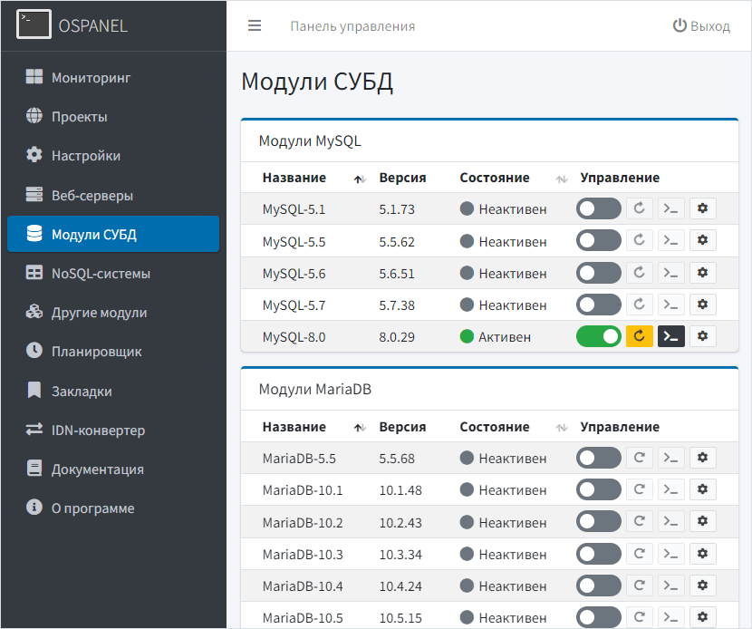

Open Server Panel 6 Beta
=======================================
            

Простой инструмент для локальной разработки веб-сайтов и веб-сервисов на платформе Windows.

Представляем вашему вниманию программный [WAMP](https://ru.wikipedia.org/wiki/WAMP)-комплекс, включающий в себя набор серверного программного обеспечения для веб-разработчиков, а также простую и удобную панель управления в двух вариантах: [веб-интерфейс](https://github.com/OSPanel/OpenServerPanel#веб-интерфейс) и [интерфейс командной строки](https://github.com/OSPanel/OpenServerPanel#интерфейс-командной-строки) (CLI).

На сегодняшний день Open Server Panel широко используется с целью разработки, отладки и тестирования веб-проектов, а также для предоставления веб-сервисов в локальных сетях. Проект завоевал большую популярность у начинающих веб-разработчиков, так как позволяет быстро развернуть рабочую среду и сразу начать изучение веб-технологий без сложных манипуляций по установке и настройке большого количества незнакомого программного обеспечения.

Смотрите документацию по новой версии в нашей [Wiki](https://github.com/OSPanel/OpenServerPanel/wiki/Документация)

Обсуждение и консультации в нашей группе [Telegram](https://t.me/ospanel_chat)

_Принимаются любые денежные пожертвования на содержание серверов и развитие проекта. Мы будем очень признательны за поддержку!_

Интерфейс командной строки
----------

Веб-интерфейс
----------

