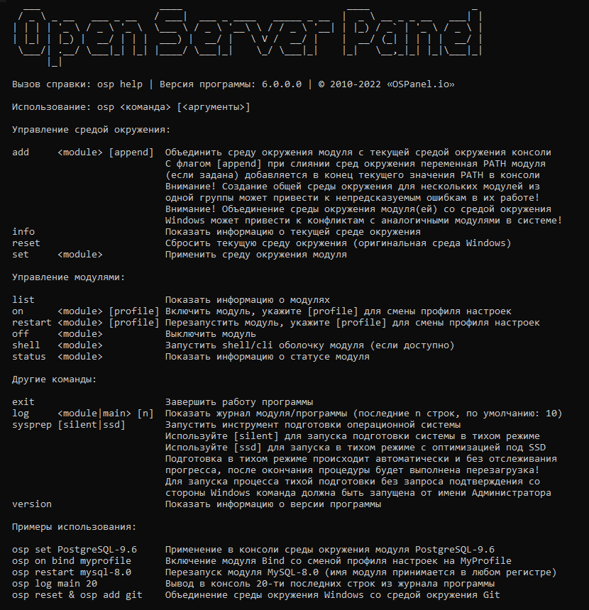

Open Server Panel 6 (Beta)
=======================================
Представляем вашему вниманию программный комплекс для платформы Windows включающий в себя тщательно подобранный набор серверного программного обеспечения, а так же удобную и продуманную панель управления с мощными возможностями по администрированию и настройке всех её компонентов.

Open Server Panel широко используется с целью разработки, отладки и тестирования веб-проектов, а так же для предоставления веб-сервисов в локальных сетях. Проект завоевал огромную популярность у начинающих веб-разработчиков, т.к. позволяет быстро развернуть рабочую среду и сразу начать изучение веб-технологий без сложных манипуляций по установке и настройке большого количества незнакомого ПО.

| :information_source: **Внимание:**  Проект в процессе публикации на GitHub! Это предупреждение исчезнет, когда мы завершим публикацию Beta-версии. |
| :--- |

Open Server Panel 6 представляет собой по сути новый программный продукт, исходный код которого был написан нами с нуля без оглядки на старые наработки. Мы надеемся увидеть ваши отзывы и справедливые оценки на нашем форуме и будем рады вашему участию в развитии проекта посредством GitHub платформы. Не бойтесь нас ругать, хвалить, предлагать что-то новое и интересное, давайте развивать проект вместе!

Основные отличия новой ветки Open Server Panel:

- Полный доступ пользователя ко всей конфигурации модулей
- Управление программой в консольном режиме и через веб-интерфейс
- Полный контроль над процессами (включая мониторинг и восстановление после сбоя)
- Возможность параллельной работы любых модулей (можно включить хоть все одновременно)
- Возможность создавать профили настроек модулей (включая файлы конфигурации)
- Персонализация настроек для каждого домена (от IP до версии PHP)
- Преднастроенная среда окружения для каждого модуля (вплоть до входа в shell/cli одной командой)
- 100% стабильность работы без багов/зависаний и проблем с кодировками
- Публичный доступ ко всем настройкам/шаблонам/языкам/документации на GitHub

Смотрите документацию по новой ветке в нашей [Wiki](https://github.com/OSPanel/OpenServerPanel/wiki/Документация)

Интерфейс командной строки
----------

Веб-интерфейс
----------

