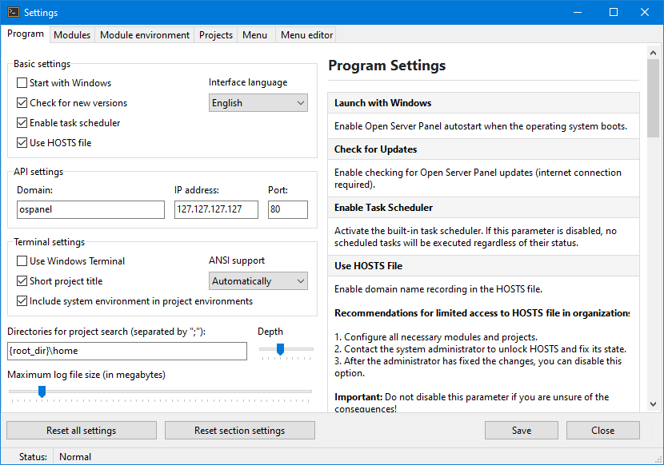
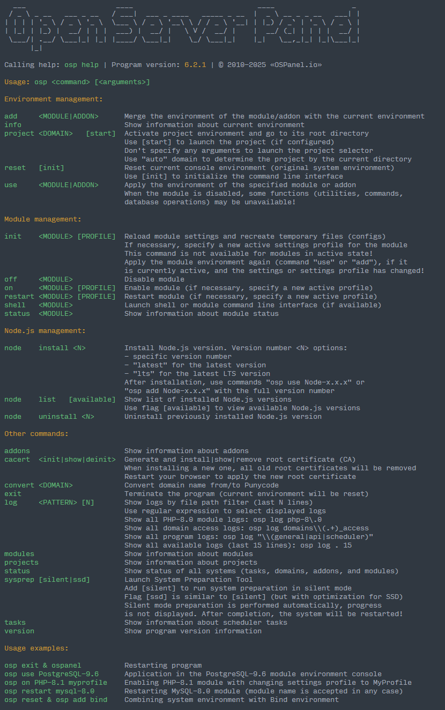

# Open Server Panel

**Full-Featured Portable Dev Machine on Steroids for Windows**

A powerful WAMP stack that replaces a dozen tools and saves hours of setup every day.

An excellent choice for those starting their journey in web development, and for professionals who don't need to be tied to a Linux environment.

## ✨ Core Stack
**Apache** (+12 modules) + **Caddy** (+142 modules) + **Nginx** (+19 modules) • **MySQL** • **MariaDB** • **MongoDB** (MongoShell + MongoTools) • **PHP** (+115 extensions) • **PostgreSQL**

## 📦 What Else Is Inside
- **Message Brokers**: RabbitMQ (+ ErlangOTP)
- **Caching**: Redis + Memcached
- **DNS Servers**: Bind + Unbound
- **Email Testing**: Mailpit + SMTP4dev
- **Media Processing**: FFMpeg + ImageMagick + Ghostscript + Libwebp
- **Runtime Environments**: Node.js (NVM) + Go
- **Backend as a Service**: PocketBase
- **File Servers**: SFTPGo (SFTP/FTP/WebDAV)
- **Secrets and Security**: Vault + age encryption

## >_ Command-Line Arsenal
Cutting-edge tools (**age**, **bat**, **dust**, **fd**, **lego**, **oha**, **opa**, **sd**, **xh**) + battle-tested classics (**7za**, **aria2c**, **brotli**, **composer**, **curl**, **geoiplookup**, **jq**, **mmdbinspect**, **sass**, **sqlite3**, **wget**)

## Why Is This a Beast?
✅ All PHP/MySQL/Node versions running simultaneously  
✅ Network stack configured out of the box  
✅ Automatic TLS certificates (local + Let's Encrypt)  
✅ Native performance without virtualization  
✅ No comparable alternatives among other Windows solutions

**In Short**: All-in-one solution for full-stack development of any complexity.

**Documentation:** [https://github.com/OSPanel/OpenServerPanel/wiki](https://github.com/OSPanel/OpenServerPanel/wiki)

**Download:** https://ospanel.io/download/

| Component | Requirements |
|---|---|
| Operating System | Windows 10, Windows Server 2016 or later |
| Hardware Resources | At least 4 GB of RAM and 15 GB of SSD. |
| Required Software | MSVC++ Redistributable Packages (included) |
| File System | NTFS (network drives are not supported) |

> [!CAUTION]
> **Not supported** Linux, macOS, Windows XP, Windows 7, Windows 8, 32‑bit systems, or processors without SSE4.2.

## GUI

## Command Line Interface

