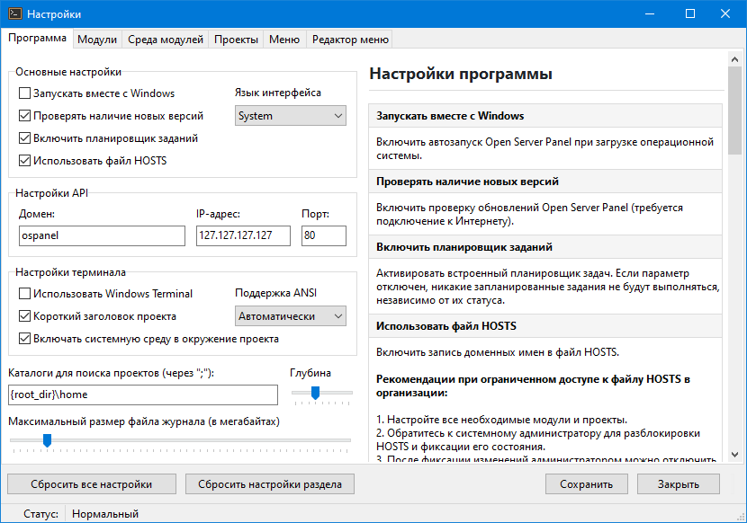
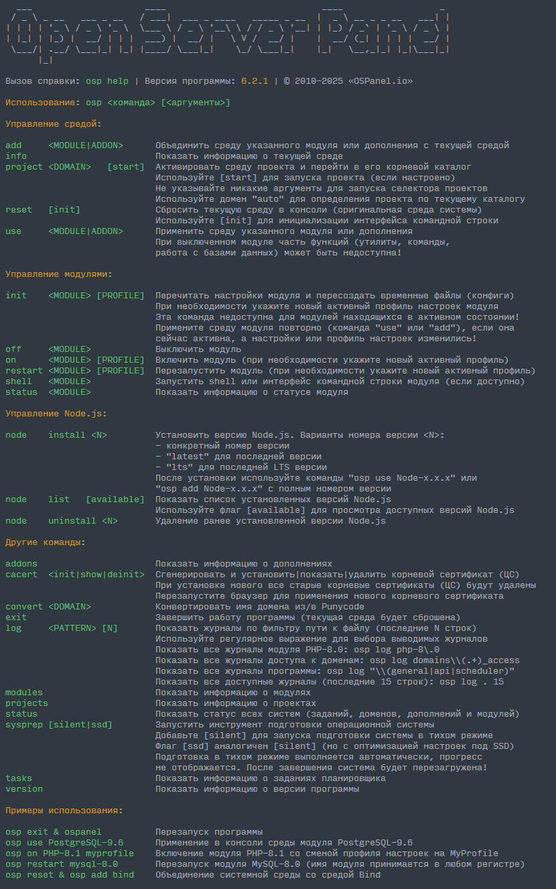

# Open Server Panel 6

## Forget the headaches of web development! 💻🚀

**Dreaming of building your own website or web service, but scared of complex server setup?** 😰

**Open Server Panel is your key to a world of hassle-free web development!** 🎉

**Imagine:**

* **User-friendly control panel** – everything at your fingertips, no complicated settings. 🖱️
* **Powerful WAMP stack** – all the tools you need for development and testing. 🧰
* **Quick start** – install the program and get started right away! ⚡
* **Flexibility and control** – configure the server to your needs. ⚙️
* **IPv6 and SSL support** – top-notch security for your project. 🔐
* **Huge community** –  get help and share your experience. 🤝

**Open Server Panel is perfect for both beginners and experienced developers.** 🎓👨‍💻

**Download Open Server Panel now and unlock a world of web development without limits!** 🌎

**P.S.** Want to receive updates more often? Support the project by choosing a paid download. 😊

## Features

### Modules & Addons

                   

### Auxiliary utilities

            

### Distinctive сharacteristics

     

**RUN MULTIPLE PHP VERSIONS AT THE SAME TIME!**

**PHPINFO:** [PHP 7.2](https://ospanel.io/phpinfo/php-7.2.html) | [PHP 7.3](https://ospanel.io/phpinfo/php-7.3.html) | [PHP 7.4](https://ospanel.io/phpinfo/php-7.4.html) | [PHP 8.0](https://ospanel.io/phpinfo/php-8.0.html) | [PHP 8.1](https://ospanel.io/phpinfo/php-8.1.html) | [PHP 8.2](https://ospanel.io/phpinfo/php-8.2.html) | [PHP 8.3](https://ospanel.io/phpinfo/php-8.3.html) | [PHP 8.4](https://ospanel.io/phpinfo/php-8.4.html)

**Documentation:** [https://github.com/OSPanel/OpenServerPanel/wiki](https://github.com/OSPanel/OpenServerPanel/wiki)

**Download:** https://ospanel.io/download/

## System Requirements

| Component | Requirements |
|---|---|
| Operating System | Windows 10 (version 1607 or later), Windows Server 2016 or later. 32-bit systems are not supported. Versions for Linux and MacOS are not available. |
| Hardware Resources | Minimum 3 GB of RAM and 10 GB of free disk space. |
| Required Software | MSVC++ 2005-2022 Redistributable Packages (x86/x64, included in the distribution). |
| File System | NTFS (network drives are not supported). |

### Support for Legacy Operating Systems

Open Server Panel can be run on older versions of Windows (x64), however with some limitations:

* Not all modules are available.
* File paths cannot exceed 255 characters.

| Operating System | Version Number | Support Level |
|---|---|---|
| Windows 7 SP1 | 6.1.7601 | Limited |
| Windows Server 2008 R2 SP1 | 6.1.7601 | Limited |
| Windows Home Server 2011 | 6.1.8400 | Limited |
| Windows Server 2012 | 6.2.9200 | Limited |
| Windows 8 | 6.2.9200 | Limited |
| Windows 8.1 | 6.3.9600 | Limited |
| Windows Server 2012 R2 | 6.3.9600 | Limited |
| Windows 10 v1507 | 10.0.10240 | Limited |
| Windows 10 v1511 | 10.0.10586 | Limited |

## GUI

## Command Line Interface

***

# Open Server Panel 6

## Забудьте о муках веб-разработки! 💻🚀

**Мечтаете создать свой сайт или веб-сервис, но пугает сложность настройки серверного ПО?** 😰

**Open Server Panel — ваш ключ к миру веб-разработки без лишних хлопот!** 🎉

**Представьте:**

* **Удобная панель управления** – всё под рукой, никаких сложных настроек. 🖱️
* **Мощный WAMP-стек** – всё необходимое для разработки и тестирования. 🧰
* **Быстрый старт** – установите программу и сразу приступайте к работе! ⚡
* **Гибкость и контроль** – настраивайте сервер под свои нужды. ⚙️
* **Поддержка IPv6 и SSL** – безопасность вашего проекта на высшем уровне. 🔐
* **Огромное сообщество** –  получайте помощь и делитесь опытом. 🤝

**Open Server Panel идеально подходит как для новичков, так и для опытных разработчиков.** 🎓👨‍💻

**Скачайте Open Server Panel прямо сейчас и откройте для себя мир веб-разработки без границ!** 🌎

**P.S.** Хотите получать обновления чаще? Поддержите проект, выбрав платную загрузку. 😊

## Возможности

### Модули и дополнения

                   

### Вспомогательные утилиты

            

### Особенности

     

**ВОЗМОЖЕН ОДНОВРЕМЕННЫЙ ЗАПУСК НЕСКОЛЬКИХ ВЕРСИЙ PHP!**

**PHPINFO:** [PHP 7.2](https://ospanel.io/phpinfo/php-7.2.html) | [PHP 7.3](https://ospanel.io/phpinfo/php-7.3.html) | [PHP 7.4](https://ospanel.io/phpinfo/php-7.4.html) | [PHP 8.0](https://ospanel.io/phpinfo/php-8.0.html) | [PHP 8.1](https://ospanel.io/phpinfo/php-8.1.html) | [PHP 8.2](https://ospanel.io/phpinfo/php-8.2.html) | [PHP 8.3](https://ospanel.io/phpinfo/php-8.3.html) | [PHP 8.4](https://ospanel.io/phpinfo/php-8.4.html)

**Документация:** [https://github.com/OSPanel/OpenServerPanel/wiki/Документация](https://github.com/OSPanel/OpenServerPanel/wiki/%D0%94%D0%BE%D0%BA%D1%83%D0%BC%D0%B5%D0%BD%D1%82%D0%B0%D1%86%D0%B8%D1%8F)

**Загрузка:** https://ospanel.io/download/

## Системные требования

| Компонент | Требования |
|---|---|
| Операционная система | Windows 10 (версия 1607 или новее), Windows Server 2016 или новее. 32-битные системы не поддерживаются. Версии для Linux и MacOS отсутствуют. |
| Аппаратные ресурсы | Минимум 3 ГБ оперативной памяти (RAM) и 10 ГБ свободного места на диске. |
| Обязательное ПО | MSVC++ 2005-2022 Redistributable Packages (x86/x64, включены в комплект поставки). |
| Файловая система | NTFS (сетевые диски не поддерживаются). |

### Поддержка устаревших операционных систем

Open Server Panel может запускаться на устаревших версиях Windows (x64), однако с некоторыми ограничениями:

* Не все модули доступны.
* Пути к файлам не могут превышать 255 символов.

| Операционная система | Номер версии | Уровень поддержки |
|---|---|---|
| Windows 7 SP1 | 6.1.7601 | Ограниченная |
| Windows Server 2008 R2 SP1 | 6.1.7601 | Ограниченная |
| Windows Home Server 2011 | 6.1.8400 | Ограниченная |
| Windows Server 2012 | 6.2.9200 | Ограниченная |
| Windows 8 | 6.2.9200 | Ограниченная |
| Windows 8.1 | 6.3.9600 | Ограниченная |
| Windows Server 2012 R2 | 6.3.9600 | Ограниченная |
| Windows 10 v1507 | 10.0.10240 | Ограниченная |
| Windows 10 v1511 | 10.0.10586 | Ограниченная |

## Графический интерфейс

## Интерфейс командной строки

