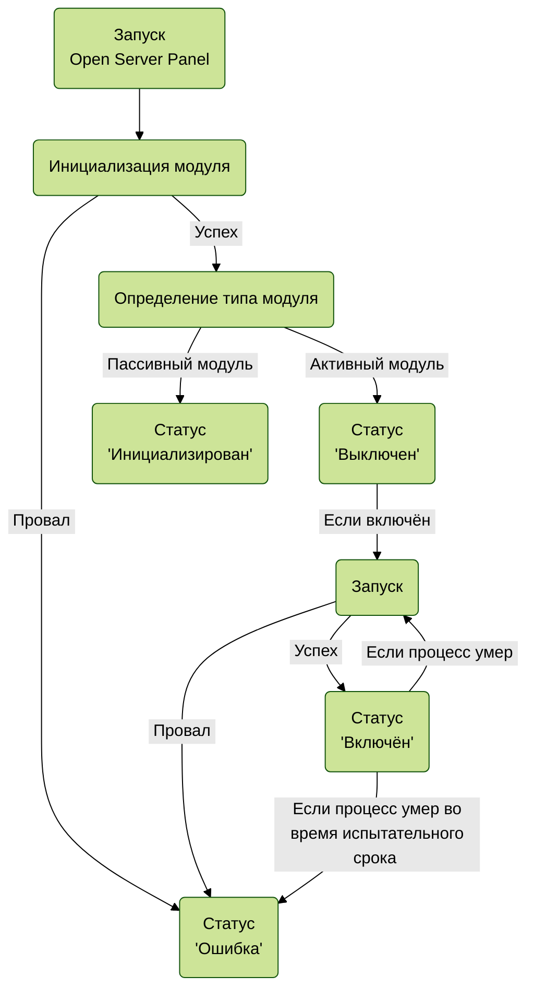

О программе  
------------
Open Server Panel является продвинутым аналогом таких [WAMP](https://ru.wikipedia.org/wiki/WAMP) сборок как Xampp, Denwer, Vertrigo, Wampserver и других, схожих с ними, программ. Если ранее вы уже работали с подобным программным обеспечением, то вам не составит труда быстро освоить и Open Server Panel. 

Open Server Panel работает без установки, потребуется лишь предварительная подготовка системы. Это означает, что вы можете спокойно переносить каталог с программой в любое место на диске или даже cкопировать его на другой компьютер. В комплект поставки уже включён инструмент для подготовки Windows к работе с Open Server Panel — [System Preparation Tool](https://github.com/OSPanel/SysPrepTool).

Управление программным комплексом может осуществляться через две панели управления: [веб-интерфейс](https://github.com/OSPanel/OpenServerPanel#%D0%B2%D0%B5%D0%B1-%D0%B8%D0%BD%D1%82%D0%B5%D1%80%D1%84%D0%B5%D0%B9%D1%81) и [интерфейс командной строки](https://github.com/OSPanel/OpenServerPanel#%D0%B8%D0%BD%D1%82%D0%B5%D1%80%D1%84%D0%B5%D0%B9%D1%81-%D0%BA%D0%BE%D0%BC%D0%B0%D0%BD%D0%B4%D0%BD%D0%BE%D0%B9-%D1%81%D1%82%D1%80%D0%BE%D0%BA%D0%B8) (CLI). Обе панели управления взаимодействуют с программой через API по HTTP-протоколу, в то время как сама программа работает незаметно для пользователя.

Веб-интерфейс находится в разработке, поэтому на данный момент управление программой доступно только в консольном режиме, а изменение настроек возможно только путём ручной правки файлов конфигурации.

Тестирование
------------

Open Server Panel 6 представляет собой, по сути, новый программный продукт, исходный код которого был написан нами с нуля без оглядки на старые наработки.

Основные отличия новой версии Open Server Panel:

- Полный доступ пользователя ко всей конфигурации модулей
- Управление программой в консольном режиме и через веб-интерфейс
- Полный контроль над процессами (включая мониторинг и восстановление после сбоя)
- Возможность параллельной работы любых модулей (можно включить хоть все одновременно)
- Возможность создавать профили настроек модулей (включая файлы конфигурации)
- Персонализация настроек для каждого домена (от IP до версии PHP)
- Преднастроенная среда окружения для каждого модуля (вплоть до входа в shell/cli одной командой)
- 100% стабильность работы без багов/зависаний и проблем с кодировками
- Публичный доступ ко всем настройкам/шаблонам/языкам/документации на GitHub

В целях тестирования мы предлагаем вам проверить работу всех доступных функций Open Server Panel на нескольких компьютерах с отличающимися версиями Windows и набором установленного ПО, если это возможно. Пожалуйста, сообщайте нам обо всех неудобствах или странностях в работе программы, а также о своих идеях по доработке/изменению функционала и интерфейса.

Beta-версия программы собрана в режиме отладки, поэтому потребляет в 4-5 раз больше оперативной памяти и работает несколько медленнее, чем будет работать финальная версия Open Server Panel без приставки Beta. В случае сбоя в своей работе программа автоматически отправит отчёт об ошибке на сервер проекта.

Уважаемые пользователи! В любой момент вы можете обратиться к нашей команде для получения консультаций по работе с новой версией Open Server Panel в нашей группе [Telegram](https://t.me/ospanel_chat).

Системные требования
------------
| Тип | Описание |
| ---: | :--- |
| **Операционная система** | Windows 7 SP1 x64 / Windows Server 2008 R2 SP1 или новее<br>Версий для Linux и MacOS нет<br>32-битные системы не поддерживаются |
| **Свободные аппаратные ресурсы** | от 3 ГБ RAM и от 10 ГБ места на диске |
| **Обязательное ПО** | MSVC++ 2005-2022 Redistributable Packages (есть в комплекте) |
| **Файловая система** | NTFS (сетевые диски не поддерживаются) |

Может потребоваться ограничение количества одновременно запускаемых модулей в случае, если в вашей системе доступно менее 3 ГБ свободной оперативной памяти. Владельцам устаревших и слабых компьютеров рекомендуется запускать не более одного модуля каждого типа одновременно.

Начало использования
------------
Рекомендуется использовать систему на базе Windows 10 или более новой версии Windows. Желательно выполнять установку на SSD-накопитель (при его наличии), что значительно повысит скорость работы всех модулей.

Не используйте Open Server Panel на USB-флеш-накопителях (быстрый износ и крайне медленная работа) и на внешних носителях информации со старым интерфейсом USB 2.0 (крайне медленная работа).

**Важно!** Не запускайте программу с правами администратора, это потенциально небезопасно и не является необходимым условием для работы Open Server Panel. Права администратора будут запрошены только при запуске System Preparation Tool.

**Шаг 1**

На время тестов [Beta](https://ru.wikipedia.org/wiki/Бета-тестирование)-версии дистрибутив распространяется в виде самораспаковывающегося RAR-архива. Скачайте дистрибутив и распакуйте его в выбранный каталог (желательно в корень диска). Разрешённые символы в пути до корневого каталога с программой: `A-Za-z0-9.+-\:_`.

**Шаг 2**

Перед началом работы обязательно добавьте каталог с программой в исключения вашего файрвола/антивируса и снимите защиту с файла [HOSTS](https://ru.wikipedia.org/wiki/Hosts) (если ваш файрвол/антивирус имеет такую защитную функцию и она не учитывает каталоги и программы добавленные в исключения).

Если файрвол/антивирус не будет правильно настроен, то из-за непрерывного сканирования файлов, к которым обращаются работающие модули, Open Server Panel будет работать заметно медленнее. На устаревших и слабых компьютерах с HDD-дисками вместо SSD падение производительности в результате излишней активности антивирусной программы может полностью парализовать нормальную работу программного комплекса. 

**Шаг 3**

Запустите файл `OSPanel.exe` и убедитесь в том, что в [области уведомлений](https://ru.wikipedia.org/wiki/Область_уведомлений) Windows появилась иконка программы. Если программа не запускается, то изучите содержимое файла `.\logs\OpenServerPanel.log`. Чаще всего ошибки запуска программы связаны с невозможностью запустить встроенный веб-сервер:

`Address already in use (#10048 in listen: Bind)` — адрес уже используется. Ошибка говорит о том, что пара ip:порт уже используется другой службой или программой в вашей системе. Измените настройки ip/порта в конфиге OSPanel, либо в настройках той службы или программы, которая их занимает.

`Permission denied (#10013 in listen: Bind)` — в разрешении отказано. Программе было запрещено занять требуемую пару ip:порт. Выполните настройку системного файрвола, чтобы разрешить программе доступ к сети.

**Шаг 4**

После запуска программы нажмите на её иконку в области уведомлений и запустите System Preparation Tool путём выбора пункта меню `Инструмент подготовки системы`, также это можно сделать запустив CLI-интерфейс и выполнив там команду `sysprep`. Выполните подготовку системы и обязательно перезагрузите компьютер. После перезагрузки компьютера программа готова к использованию, вы можете активировать необходимые модули.

**Важно!** Без подготовки системы с помощью System Preparation Tool корректная работа Open Server Panel на вашем компьютере будет невозможна! 

**Шаг 5**

После подготовки системы запустите Open Server Panel и откройте интерфейс командной строки. Если после запуска CLI-интерфейса в консоль выводится сообщение `The system cannot write to the specified device`, то установите в настройках консоли шрифт совместимый с кодировкой UTF-8 (например: Consolas) и заново запустите CLI-интерфейс.

**Готово!**

Структура каталогов
------------
    .
    ├── bin                       # Общие исполняемые файлы
    ├── config                    # Настройки
    │   ├── <имя_модуля>          # Настройки модуля
    │   │   ├── default           # Настройки модуля для профиля Default
    │   │   │   ├── templates     # Шаблоны конфигурации
    │   │   │   └── settings.ini  # Настройки модуля для профиля Default
    │   │   └── module.ini        # Базовые настройки модуля (вкл/выкл + имя профиля)
    │   ├── domains.ini           # Настройки доменов
    │   └── program.ini           # Настройки программы
    ├── data                      # Хранилище данных (базы данных и др.)
    ├── home                      # Пользовательские проекты (домены)
    ├── logs                      # Файлы журналов
    ├── modules                   # Модули
    │   └── <имя_модуля>          # Основной каталог модуля
    │       └── ospanel_data      # Служебные файлы (исходники настроек и конфигов)
    ├── system                    # Служебный каталог программы
    │   └── lang                  # Языковые файлы
    ├── temp                      # Временные файлы
    └── user                      # Пользовательские данные
        └── ssl                   # Ключи, сертификаты и служебные файлы SSL

Управление (CLI)
------------
```
Использование: osp <команда> [<аргументы>]

Управление средой окружения:

add     <MODULE>            Объединить среду окружения модуля с текущей средой окружения консоли
                            Внимание! Создание общей среды окружения для нескольких модулей из
                            одной группы может привести к непредсказуемым ошибкам в их работе!
                            Внимание! Объединение среды окружения модуля(ей) со средой окружения
                            Windows может привести к конфликтам с аналогичными модулями в системе!
info                        Показать информацию о текущей среде окружения
project <DOMAIN>            Активировать среду окружения проекта и перейти в его корневой каталог
reset   [init]              Сбросить текущую среду окружения в консоли (оригинальная среда системы)
                            Используйте флаг "init" для инициализации интерфейса командной строки
set     <MODULE>            Применить среду окружения модуля
                            Если модуль выключен, то работа с частью его утилит/команд/операций,
                            включая работу с данными (базами данных), может быть недоступна!

Управление модулями:

init    <MODULE> [PROFILE]  Перечитать настройки модуля и пересоздать временные файлы (конфиги)
                            При необходимости укажите новый активный профиль настроек модуля
                            Эта команда недоступна для включённых (запущенных) модулей!
                            Примените среду окружения модуля повторно (команда "set" или "add"),
                            если она сейчас активна, а настройки или профиль настроек изменились!
list                        Показать информацию о модулях
off     <MODULE>            Выключить модуль
on      <MODULE> [PROFILE]  Включить модуль (при необходимости укажите новый активный профиль)
restart <MODULE> [PROFILE]  Перезапустить модуль (при необходимости укажите новый активный профиль)
shell   <MODULE>            Запустить shell или интерфейс командной строки модуля (если доступно)
status  <MODULE>            Показать информацию о статусе модуля

Другие команды:

convert <DOMAIN>            Конвертировать имя домена из/в Punycode
exit                        Завершить работу программы
log     <MODULE|main>  [N]  Показать журнал модуля/программы (последние N строк, по умолчанию: 10)
sysprep [silent|ssd]        Запустить инструмент подготовки операционной системы
                            Добавьте флаг "silent" для запуска подготовки системы в тихом режиме
                            Флаг "ssd" аналогичен "silent" (но с оптимизацией настроек под SSD)
                            Подготовка в тихом режиме происходит автоматически и без отслеживания
                            прогресса, после окончания процедуры будет выполнена перезагрузка!
                            Для запуска процесса тихой подготовки без запроса подтверждения со
                            стороны Windows консоль должна быть запущена с правами Администратора
version                     Показать информацию о версии программы

Примеры использования:

osp set PostgreSQL-9.6      Применение в консоли среды окружения модуля PostgreSQL-9.6
osp on bind myprofile       Включение модуля Bind со сменой профиля настроек на MyProfile
osp restart mysql-8.0       Перезапуск модуля MySQL-8.0 (имя модуля принимается в любом регистре)
osp log main 20             Вывод в консоль 20-ти последних строк из журнала программы
osp reset & osp add git     Объединение системной среды окружения со средой окружения Git
```

### Служебные аргументы ###

Для команд `add`, `project`, `reset` и `set` можно использовать третий аргумент `silent`, который подавляет вывод информационных сообщений.  

Для команд `init`, `off`, `on`, `restart`, `status` и `log` вместо имени модуля можно использовать аргумент `all`. Используйте его только если вы точно уверены в том, что вы делаете.

Настройка программы
------------
Настройки программы и модулей (глобальные опции) задаются в файле `.\config\program.ini`.

:information_source: **Внимание:** Для применения изменений необходимо перезапустить программу.

### Секция `[main]` ###
Секция содержит основные настройки программы.
| Параметр | Описание |
| :---: | :--- |
| `domain` | Локальный домен API и веб-интерфейса. Если включено использование файла [HOSTS](https://ru.wikipedia.org/wiki/Hosts), то веб-интерфейс будет доступен в браузере на указанном домене.<br>Если в браузере используется VPN/прокси, то в настройках VPN/прокси необходимо задать исключение для этого домена. |
| `ip` | IP-адрес API и веб-интерфейса. Если в браузере используется VPN/прокси, то в настройках VPN/прокси необходимо задать исключение для этого IP. |
| `port` | Порт API и веб-интерфейса. Запуск программы будет невозможен если такой порт уже используется. |
| `clear_dns_cache` | Очищать системный кэш DNS при изменении файла [HOSTS](https://ru.wikipedia.org/wiki/Hosts) (`on`/`off`). Отключайте эту опцию только в том случае, если вы вручную внесли изменения в файл HOST, очистили кэш DNS и больше не планируете вносить изменения в настройки программы и модулей. Также эту опцию можно отключить если вы используете единственный домен — localhost. |
| `hosts_file` | Использовать файл [HOSTS](https://ru.wikipedia.org/wiki/Hosts) (`on`/`off`). Если выключено, то следующие возможности станут недоступны: использование имён модулей в качестве доменов (подключение будет возможным только по IP), использование локальных доменов (только localhost), включая использование локального домена для доступа к панели управления (см. `web_panel_domain`). |
| `hosts_file_encoding` | Кодировка файла [HOSTS](https://ru.wikipedia.org/wiki/Hosts). Допустимые значения кодировки: `UTF8`, `ANSI`, `ASCII`. |
| `lang` | Язык программы. В качестве значения используйте имя любого языкового файла из каталога `.\system\lang`. |
| `start_browser_command` | Команда вызова браузера. Путь к исполняемому файлу браузера + шаблонная переменная `{url}`, например: `"C:\Program Files (x86)\Microsoft\Edge\Application\msedge.exe" {url}`. В процессе своей работы программа будет открывать различные URL, включая вызов веб-интерфейса из трей-меню, используя эту команду. |
| `start_terminal_command` | Команда вызова интерфейса командной строки из меню программы. При формировании команды используйте шаблонную переменную `{command}`. |
| `terminal_ansi_fix` | Активация поддержки ANSI-кодов для управления цветом в консоли. Если ваш терминал нативно поддерживает ANSI-коды или наблюдаются артефакты в его работе, то отключите эту опцию. |
| `tray_icon` | Показывать иконку программы в [области уведомлений](https://ru.wikipedia.org/wiki/Область_уведомлений). Отключите эту опцию в случае, если вы запускаете программу в среде [Windows Server Core](https://en.wikipedia.org/wiki/Server_Core) или планируете использовать тип автозапуска программы который не требует входа пользователя Windows (Планировщик заданий Windows -> Запуск при загрузке компьютера). |
| `tray_menu_dark_theme` | Использовать тёмную тему для меню программы в [области уведомлений](https://ru.wikipedia.org/wiki/Область_уведомлений). |

### Секция `[modules]` ###
Секция содержит глобальные настройки модулей. Они используются в том случае, если в настройках модуля указано значение auto (по умолчанию). Эти значения можно переопределить в файле настроек у любого модуля с возможностью включения/выключения, а значения опций `allowed_env_vars`, `terminal_codepage` и `time_zone` можно переопределить в настройках любых модулей. См. файл `.\config\<имя_модуля>\<имя_профиля>\settings.ini`.
| Параметр | Описание |
| :---: | :--- |
| `allowed_env_vars` | Список переменных среды окружения Windows (через пробел) передаваемых в среду окружения модуля. Белый список переменных необходим для фильтрации рабочей среды окружения модулей от среды установленного в систему аналогичного ПО.<br><br>Вносите изменения в этот список только в том случае, если вы точно знаете что делаете, т.к. это может нарушить нормальную работу модулей. |
| `log_max_filesize` | Максимальный размер журнала (`0` — отключает ограничение). Если размер какого-либо журнала превысит указанный, то при очередном запуске модуля его файл журнала будет пересоздан.<br><br>Допустимо использование следующих обозначений: `B` — байты, `K` — килобайты, `M` — мегабайты, `G` — гигабайты, `T` — терабайты. Для принудительной очистки логов при каждом запуске установите значение равным `1` (к цифрам без обозначений применяются `B` — байты). |
| `log_write_title` | Добавлять заголовок в лог модуля при каждом запуске (`on`/`off`). Полезно для визуального разграничения рабочих сессий если не используется автоматическая очистка журнала модуля. |
| `max_probation_fails` | Максимальное кол-во последовательных (подряд) провалов испытательного срока, после которых модуль перейдёт в состояние "Ошибка" (см. probation). |
| `max_shutdown_time` | Максимальное время выключения модуля (`0` — отключает ограничение). Если рабочий процесс модуля не успел завершить свою работу за указанное время, то по завершению ожидания он будет принудительно остановлен (терминирован). Недопустимо устанавливать значение равным менее 30 сек. (меньшее значение, кроме ноля, не будет использовано программой).<br><br>Не следует устанавливать этот лимит если вы точно не знаете что делаете, т.к. преждевременная принудительная остановка рабочего процесса модуля может привести к различным проблемам (порча БД, неполная запись логов и др.).<br><br>Допустимо использование следующих обозначений: `s` — секунды, `m` — минуты, `h` — часы, `d` — дни (к цифрам без обозначений применяются `s` — секунды). |
| `probation` | Время проверки работоспособности модуля (испытательный срок). Отсчёт начинается с момента успешного запуска рабочего процесса модуля.<br><br>Если в течение испытательного срока рабочий процесс модуля неожиданно завершил свою работу, то он не будет автоматически перезапущен и модуль перейдёт в состояние "Ошибка", ожидая дополнительных действий от пользователя (например исправления файлов конфигурации). Состояние "Ошибка" также будет установлено в том случае, если запускаемый процесс не смог стартовать на системном уровне.<br><br>Значение `0` полностью отключает испытательный срок, в случае неожиданного завершения работы процесс будет всегда автоматически перезапускаться, при циклическом сбое — бесконечно. Не рекомендуется устанавливать значение `0` или задавать слишком короткий период проверки (менее 30 сек.).<br><br>Допустимо использование следующих обозначений: `s` — секунды, `m` — минуты, `h` — часы, `d` — дни (к цифрам без обозначений применяются `s` — секунды). |
| `silent_mode` | Тихий режим работы (`on`/`off`). В этом режиме не отображаются всплывающие (pop-up) сообщения об ошибках, которые генерирует служба Windows Error Reporting или сам модуль. Отключайте этот режим только тогда, когда вам требуется разобраться с проблемами в работе модуля, в остальное время он должен быть постоянно включён. |
| `terminal_codepage` | Кодировка консоли при работе со средой окружения модуля. Можно использовать значение `system`, в этом случае будет использоваться системная кодировка.<br><br>Если задать пустое значение или не задавать его вовсе, то кодировка в консоли при активации среды окружения модуля или его SHELL оболочки изменяться не будет (используется текущая активная кодировка). |
| `time_zone` | Часовой пояс (временная зона). В качестве значения этого параметра необходимо указать часовой пояс в формате Etc/GMT (например: `Etc/GMT-3`). Можно использовать значение `system`, в этом случае будет использоваться системный часовой пояс.<br><br>Внимание! Формат Etc/GMT отличается от UTC обратным порядком, например: `Etc/GMT-3` = `UTC/GMT+3` = `UTC+03:00` = `Europe/Moscow`. |

### Секция `[environment]` ###
Секция служит для управления переменными общей среды окружения. Заданные здесь переменные применяются ко всем модулям, к запускаемым процессам и к окружению самой программы, но не влияют на переменные среды окружения Windows.<br><br>Для любого модуля эти переменные можно переопределить/дополнить/удалить в файле его настроек `.\config\<имя_модуля>\<имя_профиля>\settings.ini`.<br><br>Для удаления переменной из среды окружения задайте пустое значение или используйте специальный фильтр (см. `allowed_env_vars`).<br><br>Добавьте в конец `PATH` следующую запись если планируете использовать PowerShell: `;%SYSTEMROOT%\System32\WindowsPowerShell\v1.0\`

Доступны следующие шаблонные переменные:

| Переменная | Описание |
| :---: | :--- |
| `{root_dir}` | Корневой каталог программы (полный путь) |
| `{root_drive}` | Диск корневого каталога |
| `{root_path}` | Путь к корневому каталогу программы |
| `{terminal_codepage}` | Кодировка консоли (см. `terminal_codepage`) |
| `{time_zone}` | Часовой пояс в формате Etc/GMT (см. `time_zone`) |

Помимо шаблонных переменных вы можете использовать любые переменные среды окружения Windows, например: `%SYSTEMDRIVE%`, `%USERNAME%`, `%PATH%` и т.д.

Значения секции заданные "по умолчанию":
```
[environment]

PATH                  = {root_dir}\bin;%SYSTEMROOT%\system32;%SYSTEMROOT%;%SYSTEMROOT%\System32\Wbem
HOMEDRIVE             = {root_drive}
HOMEPATH              = {root_path}\user
OSP_HOME              = {root_dir}\user
TEMP                  = {root_dir}\temp
TMP                   = {root_dir}\temp
```

Настройка доменов
------------
Домены и их настройки задаются в файле `.\config\domains.ini`. Для применения изменений необходимо перезапустить программу или модуль PHP, который вы указали в настройках домена, а также, при необходимости, очистить кэш DNS в браузере.

### Секция `[имя_домена]` ###
Секция содержит основные настройки проекта, все параметры этой секции являются необязательными.

| Параметр | Описание |
| :---: | :--- |
| `aliases` | Алиасы (псевдонимы) домена (через пробел). Если алиас не содержит символ точки `.`, то он считается поддоменом и будет дополнен именем домена, например: `www`->`www.example.local`. В качестве алиаса можно указывать и другие домены, например когда требуется использовать старый домен после переезда сайта на новый. |
| `auto_configure` | Включение/выключение автоматической конфигурации домена. Если выключено, то конфигурация этого домена для сервера Apache не будет создаваться автоматически, вам необходимо самостоятельно добавить [виртуальный хост](https://ru.wikibooks.org/wiki/VirtualHost) в шаблон конфигурации Apache. Необходимые записи в файл HOSTS вносятся всегда, независимо от значения этой опции. |
| `enabled` | Включение/выключение использования домена |
| `engine` | Модуль PHP. Указанный движок будет использоваться для обработки всех PHP-файлов этого домена. Если модуль PHP не указан или не существует (не установлен), то такой домен игнорируется. |
| `ip` | IP-адрес домена. Можно использовать значение `auto`, в этом случае будет использован IP-адрес из основных настроек модуля PHP, который назначен для этого домена. |
| `log_format` | Формат журналирования |
| `cgi_directory` | Каталог для CGI и Perl скриптов. Можно использовать шаблонные переменные. |
| `root_directory` | Корневой каталог домена. Можно использовать шаблонные переменные. |
| `ssl` | Включение/выключение использования SSL. Если SSL выключен, то работа с доменом по протоколу HTTPS будет невозможна. |
| `ssl_cert_file` | Файл сертификата. Можно использовать шаблонные переменные. |
| `ssl_key_file` | Файл ключа. Можно использовать шаблонные переменные. |
| `project_add_command` | Дополнительный набор команд, выполняемый при активации среды окружения проекта. Обычно эта опция не задаётся (пусто) или равна `cd ..` (для уточнения рабочего каталога проекта). Кодировка "по умолчанию" во время выполнения команд = 65001 (UTF-8), её можно изменить командой `chcp <КОДИРОВКА>`.<br><br>**Важно!** Для вызова подпрограмм обязательно используйте `call`!<br><br>Пример **НЕправильной** команды: `cd .. & {root_dir}\home\{host}\test.bat`<br>Пример **правильной** команды: `cd .. & call {root_dir}\home\{host}\test.bat` |
| `project_add_modules` | Перечисление дополнительных модулей, которые используются проектом (через пробел). Этот список используется при активации среды окружения проекта по команде `osp project <MODULE>`. |
| `project_use_sys_env` | Включение/выключение использования среды окружения Windows для проекта. Активируйте эту опцию с осторожностью, т.к. объединение среды окружения проекта со средой окружения Windows может привести к конфликтам с аналогичными модулями в системе! |
| `terminal_codepage` | Кодировка консоли при работе со средой окружения проекта (например 65001 или 1251). Если параметр не задан, то будет использована кодировка заданная для среды окружения модуля PHP или, если для проекта указаны дополнительные модули, последнего активированного модуля из списка `project_modules`. Если кодировка указана, то она активируется ПОСЛЕ выполнения всех служебных команд, включая `project_command`. |

Доступны следующие шаблонные переменные:

| Переменная | Описание |
| :---: | :--- |
| `{host}` | Имя домена |
| `{root_dir}` | Корневой каталог программы (полный путь) |
| `{root_drive}` | Диск корневого каталога |
| `{root_path}` | Путь к корневому каталогу программы |

Настройка модулей
------------
Настройки любого из модулей в Open Server Panel задаются в файле `.\config\<имя_модуля>\<имя_профиля>\settings.ini`. По умолчанию используется профиль `Default`. Имя рабочего профиля задаётся через панель управления программой.<br><br>Резервная копия оригинальных настроек и оригинальных файлов конфигурации модуля хранится в каталоге `.\modules\<имя_модуля>\ospanel_data\original` и в будущем будет использоваться в панели управления для функции восстановления оригинальной конфигурации.
<br><br>Вы можете самостоятельно создавать дополнительные профили настроек модулей. Для создания нового профиля, например `MyProfile`, достаточно создать копию каталога любого другого существующего профиля у выбранного модуля, например скопировав каталог оригинального профиля `.\config\<имя_модуля>\Default` в `.\config\<имя_модуля>\MyProfile`. Допустимые символы в имени профиля: `A-Za-z0-9-+_.()`. Использование собственных профилей может быть полезно в ряде случаев, например, когда вам необходимо протестировать новую конфигурацию модуля или вы просто хотите поэкспериментировать.
<br><br>
:information_source: **Внимание:** Для применения изменений модуль необходимо перезапустить/переинициализировать.
<br><br>:warning: **Важно!** Не редактируйте файл базовых настроек модуля `.\config\<имя_модуля>\module.ini`. Процесс работы с ним полностью автоматизирован и не требует вмешательства пользователя.

### Секция `[main]` ###
Секция содержит основные настройки модуля, все параметры этой секции являются необязательными.

| Параметр | Описание |
| :---: | :--- |
| `ip` | IP-адрес модуля. Можно задавать несколько IP (через пробел) и IP в формате IPv6 в случаях когда модуль это поддерживает. Если вы указываете несколько IP-адресов, то при обновлении файла [HOSTS](https://ru.wikipedia.org/wiki/Hosts) в качестве IP для имени модуля будет использован первый указанный IP. Настройка IP игнорируется для модулей DNS. |
| `port` | Порт модуля. Настройка порта игнорируется для модулей классов Web Server и DNS. |
| `clean_directories` | Каталоги очищаемые перед запуском модуля (через пробел). Например: кэш, временные файлы и тому подобное. Можно использовать шаблонные переменные. |
| `log_directory` | Каталог для хранения собственных журналов модуля. Если каталог не существует, то он будет создан в процессе запуска модуля. Можно использовать шаблонные переменные. |
| `log_level_values` | Доступные уровни журналирования (принимает разные значения и поддерживается не всеми модулями) |
| `log_level` | Уровень журналирования (должен быть равен любому значению из `log_level_values`) |
| `query_log_values` | Доступные уровни журналирования запросов (принимает разные значения и поддерживается не всеми модулями) |
| `query_log_level` | Уровень журналирования запросов (должен быть равен любому значению из `query_log_values`) |
| `shell_command` | Команда запуска SHELL оболочки или CLI интерфейса модуля. Можно использовать шаблонные переменные. |
| `start_command` | Команда запуска модуля. Можно использовать шаблонные переменные. |
| `start_directory` | Каталог запуска модуля (каталог должен существовать). Можно использовать шаблонные переменные. |
| `work_directories` | Каталоги необходимые для работы модуля (через пробел). Если каталог не существует, то он будет создан в процессе запуска модуля. Можно использовать шаблонные переменные. |
| `allowed_env_vars` | Список переменных среды окружения Windows (через пробел) передаваемых в среду окружения модуля. Белый список переменных необходим для фильтрации рабочей среды окружения модулей от среды установленного в систему аналогичного ПО.<br><br>Вносите изменения в этот список только в том случае, если вы точно знаете что делаете, т.к. это может нарушить нормальную работу модулей.<br><br>Можно использовать значение `auto`, в этом случае будет использовано глобальное значение из основных настроек программы. |
| `log_max_filesize` | Максимальный размер журнала (`0` — отключает ограничение). Если размер какого-либо журнала превысит указанный, то при очередном запуске модуля его файл журнала будет пересоздан.<br><br>Можно использовать значение `auto`, в этом случае будет использовано глобальное значение из основных настроек программы.<br><br>Допустимо использование следующих обозначений: `B` — байты, `K` — килобайты, `M` — мегабайты, `G` — гигабайты, `T` — терабайты. Для принудительной очистки логов при каждом запуске установите значение равным `1` (к цифрам без обозначений применяются `B` — байты). |
| `log_write_title` | Добавлять заголовок в лог модуля при каждом запуске (`on`/`off`). Полезно для визуального разграничения рабочих сессий если не используется автоматическая очистка журнала модуля.<br><br>Можно использовать значение `auto`, в этом случае будет использовано глобальное значение из основных настроек программы. |
| `max_probation_fails` | Максимальное кол-во последовательных (подряд) провалов испытательного срока, после которых модуль перейдёт в состояние "Ошибка" (см. probation).<br><br>Можно использовать значение `auto`, в этом случае будет использовано глобальное значение из основных настроек программы. |
| `max_shutdown_time` | Максимальное время выключения модуля (`0` — отключает ограничение). Если рабочий процесс модуля не успел завершить свою работу за указанное время, то по завершению ожидания он будет принудительно остановлен (терминирован). Недопустимо устанавливать значение равным менее 30 сек. (меньшее значение, кроме ноля, не будет использовано программой).<br><br>Не следует устанавливать этот лимит если вы точно не знаете что делаете, т.к. преждевременная принудительная остановка рабочего процесса модуля может привести к различным проблемам (порча БД, неполная запись логов и др.).<br><br>Можно использовать значение `auto`, в этом случае будет использовано глобальное значение из основных настроек программы.<br><br>Допустимо использование следующих обозначений: `s` — секунды, `m` — минуты, `h` — часы, `d` — дни (к цифрам без обозначений применяются `s` — секунды). |
| `probation` | Время проверки работоспособности модуля (испытательный срок). Отсчёт начинается с момента успешного запуска рабочего процесса модуля.<br><br>Если в течение испытательного срока рабочий процесс модуля неожиданно завершил свою работу, то он не будет автоматически перезапущен и модуль перейдёт в состояние "Ошибка", ожидая дополнительных действий от пользователя (например исправления файлов конфигурации). Состояние "Ошибка" также будет установлено в том случае, если запускаемый процесс не смог стартовать на системном уровне.<br><br>Значение `0` полностью отключает испытательный срок, в случае неожиданного завершения работы процесс будет всегда автоматически перезапускаться, при циклическом сбое — бесконечно. Не рекомендуется устанавливать значение `0` или задавать слишком короткий период проверки (менее 30 сек.).<br><br>Можно использовать значение `auto`, в этом случае будет использовано глобальное значение из основных настроек программы.<br><br>Допустимо использование следующих обозначений: `s` — секунды, `m` — минуты, `h` — часы, `d` — дни (к цифрам без обозначений применяются `s` — секунды). |
| `silent_mode` | Тихий режим работы (`on`/`off`). В этом режиме не отображаются всплывающие (pop-up) сообщения об ошибках, которые генерирует служба Windows Error Reporting или сам модуль. Отключайте этот режим только тогда, когда вам требуется разобраться с проблемами в работе модуля, в остальное время он должен быть постоянно включён.<br><br>Можно использовать значение `auto`, в этом случае будет использовано глобальное значение из основных настроек программы. |
| `terminal_codepage` | Кодировка консоли при работе со средой окружения модуля. Можно использовать специальные значения `system` (системная кодировка) или `auto` (глобальное значение из основных настроек программы).<br><br>Если задать пустое значение или не задавать его вовсе, то кодировка в консоли при активации среды окружения модуля или его SHELL оболочки изменяться не будет (используется текущая активная кодировка). |
| `time_zone` | Часовой пояс (временная зона). В качестве значения этого параметра необходимо указать часовой пояс в формате Etc/GMT (например: `Etc/GMT-3`). Можно использовать специальные значения `system` (системный часовой пояс) или `auto` (глобальное значение из основных настроек программы).<br><br>Внимание! Формат Etc/GMT отличается от UTC обратным порядком, например: `Etc/GMT-3` = `UTC/GMT+3` = `UTC+03:00` = `Europe/Moscow`. |

Доступны следующие шаблонные переменные:

| Переменная | Описание |
| :---: | :--- |
| `{module_name}` | Имя модуля |
| `{root_dir}` | Корневой каталог программы (полный путь) |
| `{root_drive}` | Диск корневого каталога |
| `{root_path}` | Путь к корневому каталогу программы |

Для параметров `cmd` и `shell` секции `[main]` доступны также следующие шаблонные переменные (если одноимённые параметры заданы в этой же секции):

| Переменная | Описание |
| :---: | :--- |
| `{ip}` | IP-адрес(а) модуля |
| `{port}` | Порт модуля |
| `{log_level}` | Уровень журналирования |
| `{query_log_level}` | Уровень журналирования запросов |
| `{terminal_codepage}` | Кодировка консоли |
| `{time_zone}` | Часовой пояс в формате Etc/GMT |

Помимо шаблонных переменных вы можете использовать любые переменные среды окружения Windows, например: `%SYSTEMDRIVE%`, `%USERNAME%`, `%PATH%` и т.д.

### Секция `[environment]` ###
Секция служит для задания/переопределения переменных среды окружения модуля (поддерживаемые переменные зависят от модуля). Для удаления переменной из среды окружения задайте пустое значение.

Доступны следующие шаблонные переменные:

| Переменная | Описание |
| :---: | :--- |
| `{module_name}` | Имя модуля |
| `{root_dir}` | Корневой каталог программы (полный путь) |
| `{root_drive}` | Диск корневого каталога |
| `{root_path}` | Путь к корневому каталогу программы |

Доступны также следующие шаблонные переменные, если одноимённые параметры заданы в секции `[main]`:

| Переменная | Описание |
| :---: | :--- |
| `{ip}` | IP-адрес(а) модуля |
| `{port}` | Порт модуля |
| `{log_level}` | Уровень журналирования |
| `{query_log_level}` | Уровень журналирования запросов |
| `{terminal_codepage}` | Кодировка консоли |
| `{time_zone}` | Часовой пояс в формате Etc/GMT |

Помимо шаблонных переменных вы можете использовать любые переменные среды окружения Windows, например: `%SYSTEMDRIVE%`, `%USERNAME%`, `%PATH%` и т.д.

### Секция `[имя_файла]` ###
Секции этого типа описывают работу с шаблонами файлов конфигурации и с шаблонами других служебных файлов модуля (кол-во секций не ограничено). Шаблоны находятся в каталоге `.\config\<имя_модуля>\<имя_профиля>\templates`. В процессе инициализации модуля шаблоны, описанные в таких секциях, преобразуются во временные рабочие файлы, которые необходимы для работы модуля.

| Параметр | Обязательный | Описание |
| :---: | :---: | :--- |
| `comment` | да | Символ комментария для использования в файле конфигурации. |
| `destination` | да | Файл назначения. Это временный файл, он пересоздаётся при каждой инициализации модуля и не подлежит редактированию. |
| `enabled` | нет | Включение/выключение использования этого файла конфигурации. Задайте значение `off` в том случае, если этот файл временно не требуется для работы модуля (по молчанию `on`). |
| `encoding` | нет | Кодировка файла конфигурации (по умолчанию `UTF8`).<br>Допустимые значения `UTF8`, `ANSI`, `ASCII`. |
| `path_separator` | да | Символ разделителя, используемый в именах путей к нужным ресурсам. |

Доступны следующие шаблонные переменные:

| Переменная | Описание |
| :---: | :--- |
| `{module_name}` | Имя модуля |
| `{root_dir}` | Корневой каталог программы (полный путь) |
| `{root_drive}` | Диск корневого каталога |
| `{root_path}` | Путь к корневому каталогу программы |

Помимо шаблонных переменных вы можете использовать любые переменные среды окружения Windows, например: `%SYSTEMDRIVE%`, `%USERNAME%`, `%PATH%` и т.д.

В исходном коде файлов-шаблонов, описанных в подобных секциях, вы можете использовать следующие шаблонные переменные:

| Переменная | Описание |
| :---: | :--- |
| `{module_name}` | Имя модуля |
| `{root_dir}` | Корневой каталог программы (полный путь) |
| `{root_drive}` | Диск корневого каталога |
| `{root_path}` | Путь к корневому каталогу программы |
| **Особые переменные:** | Доступны только если заданы в секции `[main]` файла настроек модуля |
| `{ip}` | IP-адрес(а) модуля |
| `{port}` | Порт модуля |
| `{log_level}` | Уровень журналирования |
| `{query_log_level}` | Уровень журналирования запросов |
| `{shell_command}` | Команда для запуска shell/cli оболочки модуля |
| `{terminal_codepage}` | Кодировка консоли |
| `{time_zone}` | Часовой пояс в формате Etc/GMT |
| **Служебные переменные:** | Только для специалистов по написанию модулей |
| `{api_url}` | URL-адрес для доступа к API |
| `{default_environment}` | Среда окружения программы (начальная, формируемая по умолчанию) |
| `{environment}` | Блок формирования среды окружения модуля (Batch script формат) |
| `{lang_N}` | Текстовая строка под номером (N) из языкового файла (используемого в данный момент языка) |
| `{modules_list}` | Список доступных модулей (через двоеточие) |
| `{active_modules_list}` | Список доступных активных модулей (через двоеточие) |
| `{passive_modules_list}` | Список доступных пассивных модулей (через двоеточие) |
| `{osp_version}` | Версия программы |
| `{osp_version_datetime}` | Дата выхода версии (дата компиляции) |
| `{windows_environment}` | Среда окружения Windows (оригинальная, сформированная на момент запуска программы) |

Работа с модулями
------------

По умолчанию никакие модули не включены. Перед началом работы с Open Server Panel убедитесь в том, что вы включили нужные вам модули.

Все модули настроены на использование только локальных IP-адресов (кроме Bind и Unbound), стандартных для них портов и стандартных логинов, пароли или какие-либо ограничения по умолчанию не используются. Вы всегда можете самостоятельно изменить эти настройки по своему усмотрению.

:information_source: **Внимание:** Запуск модулей PostgreSQL при отключённом контроле учётных записей (UAC) или с правами Администратора невозможен!

:warning: **Важно!** Не запускайте Open Server Panel на публичных IP без дополнительной защиты и предварительной тщательной настройки, это крайне опасно и может привести к несанкционированному доступу к вашему компьютеру, вплоть до полного контроля над системой и потери всех файлов.

Обязательно задайте надёжные пароли для всех пользователей (если модуль имеет такую возможность) и выполните настройку прав удалённого доступа до того, как вы запустите какой-либо модуль на публичном IP (если планируете).

### Типы модулей ###

В составе Open Server Panel имеются активные (запускаемые) и пассивные (не подлежащие запуску) модули. Пассивные модули (Git, Perl и др.) используются в качестве дополнений для активных модулей или для рабочей среды окружения в консоли.

Любые модули могут включаться параллельно и никак не мешают работе друг друга. Каждый модуль имеет собственную, изолированную от Windows, среду окружения и не конфликтует с другим подобным ПО в вашей системе. Параллельно могут быть включены даже однотипные модули, например: MySQL-5.5 и MySQL-8.0.

### Инициализация ###

При запуске программы выполняется инициализация всех доступных модулей, в процессе которой происходит чтение и проверка их конфигурации, создание временных файлов и запись данных в файл HOSTS. Таким образом, вы всегда можете использовать консольные утилиты и команды модуля независимо от того, включён он сейчас или нет, но не стоит забывать о том, что часть утилит и команд может не работать когда модуль выключен. Это может пригодиться при необходимости починить базы данных, обновить хранилище данных до запуска модуля, проверить временный файл конфигурации на корректность, а также во многих других ситуациях.



### Подключение ###

Для подключения к модулям из PHP скриптов и любого стороннего ПО используйте стандартный порт модуля и имя самого модуля в качестве адреса (хоста, сервера), примеры:

**Подключение к MySQL-5.7**

Хост: mysql-5.7 (можно использовать MySQL-5.7, регистр роли не играет)
<br>Порт: 3306
<br>Пользователь: root
<br>Пароль: (пустой)

**Подключение к PostgreSQL-12**

Хост: PostgreSQL-12
<br>Порт: 5432
<br>Пользователь: postgres
<br>Пароль: (пустой)

**Подключение к MongoDB-4.4**

Хост: MongoDB-4.4
<br>Порт: 27017
<br>Пользователь: (пусто)
<br>Пароль: (пусто)

**Подключение к Redis-5.0**

Хост: Redis-5.0
<br>Порт: 6379

и так далее...

### Работа в консоли ###

Для всех модулей в составе Open Server Panel выполнена предварительная настройка переменных окружения, а также реализована возможность быстрого запуска shell/cli оболочки, если таковая имеется. Чтобы запустить shell/cli оболочку какого-либо модуля (при наличии) не обязательно активировать или присоединять его среду окружения.

Модули разного типа можно объединять в одну общую среду окружения. PHP модули являются комбинированными, они объединяют в себе Apache + PHP и используют среду окружения Perl, поэтому при активации среды окружения любого PHP модуля вам также будут доступны утилиты Apache и Perl.

Пример включения нескольких модулей и комбинации их сред окружения: 

```
osp on PHP-7.4 & osp on MySQL-5.7 & osp on Redis-7.0 & osp set PHP-7.4 & osp add MySQL-5.7 & osp add Redis-7.0
```

Вы получите примерно такой вывод в консоль:

```
PHP-7.4: Рабочий процесс модуля успешно запущен

MySQL-5.7: Рабочий процесс модуля успешно запущен

Redis-7.0: Рабочий процесс модуля успешно запущен

Текущая среда окружения: PHP-7.4

Текущая среда окружения: PHP-7.4 + MySQL-5.7

Текущая среда окружения: PHP-7.4 + MySQL-5.7 + Redis-7.0
```

После выполнения этой команды текущая среда окружения позволит вам одновременно работать с PHP-7.4, Apache-2.4 и Perl (поскольку PHP это комбинированный модуль), а также с MySQL-5.7 и Redis-7.0 никуда не переключаясь. Например вот так можно посмотреть версию PHP и вывести список процессов через shell оболочку MySQL-5.7:

```
php -v
osp shell MySQL-5.7
show processlist;
quit
```

### Работа c Composer ###

Composer установлен и доступен "из коробки", какая-либо настройка не требуется. Для работы с Composer в консоли достаточно активировать среду окружения любого модуля PHP. Стоит учитывать, что каждый модуль PHP имеет свою собственную версию Composer и отдельный домашний каталог для Composer.

Пример установки Zephir в PHP 7.4 с помощью Composer:

В шаблоне php.ini PHP 7.4  `.\config\PHP-7.4\default\templates\php.ini` раскомментируем расширение zephir_parser и сохраняем изменения. Далее все действия выполняются в консоли (Меню->Интерфейс командной строки).

```
osp restart php-7.4 & osp set php-7.4
cd %COMPOSER_HOME%
composer require phalcon/zephir
zephir help
```

Сторонние расширения
------------
Мы добавили в дистрибутив 104 расширения PHP и 14 расширений Apache от сторонних разработчиков. Все эти расширения по умолчанию выключены, чтобы активировать расширение достаточно его раскомментировать в шаблоне конфигурации Apache/PHP и перезапустить Apache/PHP-модуль.

### Расширения PHP ###

Если какое-либо расширение недоступно для определённой версии PHP, то это означает что разработчики расширения либо не распространяют, либо не разрабатывали, либо не скомпилировали windows-версию расширения для этой версии PHP.

| | Расширение | PHP&nbsp;7.1<br><sub>VC14/TS</sub> | PHP&nbsp;7.2<br><sub>VC15/TS</sub> | PHP&nbsp;7.3<br><sub>VC15/TS</sub> | PHP&nbsp;7.4<br><sub>VC15/TS</sub> | PHP&nbsp;8.0<br><sub>VS16/TS</sub> | PHP&nbsp;8.1<br><sub>VS16/TS</sub> | PHP&nbsp;8.2<br><sub>VS16/TS</sub>
:---: | :---: | :---: | :---: | :---: | :---: | :---: | :---: | :---:
[](https://github.com/php-amqp/php-amqp) | [amqp](https://pecl.php.net/package/amqp) | 1.9.4 | 1.10.2 | 1.11.0 | 1.11.0 | 1.11.0 | 1.11.0 |
[](https://github.com/krakjoe/apcu) | [apcu](https://pecl.php.net/package/APCu) | 5.1.18 | 5.1.19 | 5.1.21 | 5.1.21 | 5.1.21 | 5.1.21 |
[](https://github.com/m6w6/ext-apfd) | [apfd](https://pecl.php.net/package/apfd) |   | 1.0.2 | 1.0.3 | 1.0.3 | 1.0.3 | 1.0.3 |
[](https://github.com/nikic/php-ast) | [ast](https://pecl.php.net/package/ast) | 1.0.5 | 1.0.10 | 1.0.16 | 1.0.16 | 1.0.16 | 1.0.16 |
[](https://github.com/php/pecl-numbers-bitset) | [bitset](https://pecl.php.net/package/Bitset) | 3.0.1 | 3.0.1 | 3.0.1 | 3.0.1 | 3.0.1 | 3.0.1 |
[](https://www.blackfire.io/) | [blackfire](https://www.blackfire.io/) | 1.86.1 | 1.86.1 | 1.86.1 | 1.86.1 | 1.86.1 | 1.86.1 | 1.86.1
[](https://github.com/krakjoe/cmark) | [cmark](https://pecl.php.net/package/cmark) | 1.1.0 | 1.1.0 | 1.1.0 |   |   |   |
[](https://github.com/krakjoe/componere) | [componere](https://pecl.php.net/package/componere) | 3.1.1 | 3.1.2 | 3.1.2 | 3.1.2 |   |   |
[](https://github.com/couchbase/php-couchbase) | [couchbase](https://pecl.php.net/package/couchbase) | 2.6.1 | 3.0.4 | 3.2.2 | 3.2.2 | 3.2.2 | 3.2.2 |
[](https://github.com/bukka/php-crypto) | [crypto](https://pecl.php.net/package/crypto) | 0.3.1 |   | 0.3.2 | 0.3.2 | 0.3.2 | 0.3.2 |
[](https://gitlab.com/Girgias/csv-php-extension) | [csv](https://pecl.php.net/package/CSV) |   |   | 0.3.1 | 0.3.1 | 0.4.1 | 0.4.1 |
[](https://github.com/php/pecl-database-dbase) | [dbase](https://pecl.php.net/package/dbase) | 7.0.1 | 7.0.1 | 7.1.1 | 7.1.1 | 7.1.1 | 7.1.1 |
[](https://github.com/php-decimal/ext-decimal) | [decimal](https://pecl.php.net/package/decimal) | 1.3.0 | 1.3.1 | 1.4.0 | 1.4.0 | 1.4.0 | 1.4.0 |
[](https://github.com/php/pecl-system-dio) | [dio](https://pecl.php.net/package/dio) | 0.1.0 | 0.2.0 | 0.2.0 | 0.2.1 | 0.2.1 | 0.2.1 |
[](http://svn.php.net/viewvc/pecl/doublemetaphone/) | [doublemetaphone](https://pecl.php.net/package/doublemetaphone) | 1.0.1 | 1.0.1 | 1.0.1 | 1.0.1 | | |
[](https://github.com/php-ds/ext-ds) | [ds](https://pecl.php.net/package/ds) | 1.2.9 | 1.3.0 | 1.4.0 | 1.4.0 | 1.4.0 | 1.4.0 |
[](https://bitbucket.org/osmanov/pecl-ev/src/master/) | [ev](https://pecl.php.net/package/ev) |   | 1.0.9 | 1.1.5 | 1.1.5 | 1.1.5 | 1.1.5 |
[](https://bitbucket.org/osmanov/pecl-event/src/master/) | [event](https://pecl.php.net/package/event) | 2.4.2 | 3.0.2 | 3.0.6 | 3.0.6 | 3.0.6 | 3.0.6 |
[](https://github.com/bukka/php-fann) | [fann](https://pecl.php.net/package/fann) | 1.1.1 | 1.1.1 | 1.1.1 | 1.1.1 | 1.2.0RC2 | 1.2.0RC2 |
[](http://svn.php.net/viewvc/pecl/gender/) | [gender](https://pecl.php.net/package/gender) | 1.1.0 | 1.1.0 | 1.1.0 | 1.1.0 |  |  |
[](https://github.com/php/pecl-networking-geoip) | [geoip](https://pecl.php.net/package/geoip) | 1.1.1 | 1.1.1 | 1.1.1 | 1.1.1 |   |   |
[](https://github.com/php-geospatial/geospatial) | [geospatial](https://pecl.php.net/package/geospatial) | 0.2.1 | 0.2.1 | 0.2.1 | 0.3.1 | 0.3.1 | 0.3.1 |
[](https://github.com/grpc/grpc/tree/master/src/php/ext/grpc) | [grpc](https://pecl.php.net/package/gRPC) | 1.25.0 | 1.34.0 | 1.43.0 | 1.43.0 | 1.43.0 | 1.43.0 |
[](https://github.com/hprose/hprose-pecl) | [hprose](https://pecl.php.net/package/hprose) | 1.6.8 | 1.8.0 | 1.8.0 | 1.8.0 |   |   |
[](https://github.com/php/pecl-datetime-hrtime) | [hrtime](https://pecl.php.net/package/hrtime) | 0.6.0 | 0.6.0 | 0.6.0 | 0.6.0 |   |   |
[](https://github.com/m6w6/ext-http) | [http](https://pecl.php.net/package/pecl_http) | 3.2.3 | 3.2.3 | 3.2.4 | 3.2.5 | 4.2.2 | 4.2.2 |
[](https://github.com/improved-php-library/http-message) | [http_message](https://pecl.php.net/package/http_message) |  | 0.2.2 | 0.2.2 |  | | 0.2.2 |
[](https://github.com/ice/framework) | [ice](https://pecl.php.net/package/ice) |   | 1.7.0 | 1.7.0 | 1.8.0 | 1.8.0 |   |
[](https://github.com/igbinary/igbinary/) | [igbinary](https://pecl.php.net/package/igbinary) | 3.0.1 | 3.2.14 | 3.2.14 | 3.2.14 | 3.2.14 | 3.2.14 | 3.2.14
[](https://github.com/Imagick/imagick) | [imagick](https://pecl.php.net/package/imagick) | 3.4.4 | 3.4.4 | 3.6.0 | 3.7.0 | 3.7.0 | 3.7.0 | 3.7.0
[](https://github.com/TysonAndre/immutable_cache-pecl) | [immutable_cache](https://pecl.php.net/package/immutable_cache) | | | | | 6.1.0 | 6.1.0 | 6.1.0
[](https://www.ioncube.com/loaders.php) | [ioncube](https://www.ioncube.com/loaders.php) | 12.0.5 | 12.0.5 | 12.0.5 | 12.0.5 |   | 12.0.5 |
[](https://github.com/chrislim2888/IP2Location-PECL-Extension) | [ip2location](https://pecl.php.net/package/ip2location) |   |   | 8.1.1 | 8.1.1 |   |   |
[](https://github.com/sqmk/pecl-jsmin) | [jsmin](https://pecl.php.net/package/jsmin) |   |   | 3.0.0 | 3.0.0 |   |   |
[](https://github.com/supermetrics-public/pecl-jsonpath) | [jsonpath](https://pecl.php.net/package/jsonpath) |   |   |   | 1.0.0 | 1.0.0 | 1.0.0 |
[](https://github.com/m6w6/ext-json_post) | [json_post](https://pecl.php.net/package/json_post) |   | 1.0.2 | 1.1.0 | 1.1.0 | 1.1.0 | 1.1.0 |
[](https://github.com/laruence/php-lua) | [lua](https://pecl.php.net/package/lua) | 2.0.6 | 2.0.7 | 2.0.7 | 2.0.7 |   |   |
[](https://phabricator.wikimedia.org/diffusion/MLUS/repository/master/) | [luasandbox](https://pecl.php.net/package/LuaSandbox) | | | 4.0.2 | 4.0.2 | 4.0.2 | 4.0.2 |
[](https://github.com/php/pecl-file_formats-lzf) | [lzf](https://pecl.php.net/package/lzf) | 1.6.7 | 1.6.8 | 1.7.0 | 1.7.0 | 1.7.0 | 1.7.0 |
[](https://github.com/php/pecl-mail-mailparse) | [mailparse](https://pecl.php.net/package/mailparse) | 3.0.3 | 3.1.1 | 3.1.2 | 3.1.3 | 3.1.3 | 3.1.3 |
[](https://github.com/maxmind/MaxMind-DB-Reader-php) | [maxminddb](https://pecl.php.net/package/maxminddb) |   |   | 1.11.0 | 1.11.0 | 1.11.0 | 1.11.0 |
[](https://github.com/websupport-sk/pecl-memcache) | [memcache](https://pecl.php.net/package/memcache) | 8.2 | 8.2 | 8.2 | 8.2 | 8.2 | 8.2 | 8.2
[](https://github.com/php-memcached-dev/php-memcached) | [memcached](https://pecl.php.net/package/memcached) | 3.1.4 | 3.1.5 | 3.1.5 | 3.2.0 | 3.2.0 | 3.2.0  |
[](https://github.com/mongodb/mongo-php-driver) | [mongodb](https://pecl.php.net/package/mongodb) | 1.6.0 | 1.15.1 | 1.15.1 | 1.15.1 | 1.15.1 | 1.15.1 | 1.15.1
[](https://github.com/msgpack/msgpack-php) | [msgpack](https://pecl.php.net/package/msgpack) | 2.0.3 | 2.1.2 | 2.1.2 | 2.1.2 | 2.1.2 | 2.2.0RC1 |
[](https://github.com/microsoft/mysqlnd_azure) | [mysqlnd_azure](https://pecl.php.net/package/mysqlnd_azure) | | 1.1.1 | 1.1.1 | 1.1.1 | 1.1.1 |  |
[](https://github.com/php/pecl-database-mysql_xdevapi) | [mysql_xdevapi](https://pecl.php.net/package/mysql_xdevapi) | 8.0.18 | 8.0.22 | 8.0.27 | 8.0.28 | 8.0.28 |  |
[](https://github.com/php/pecl-web_services-oauth) | [oauth](https://pecl.php.net/package/oauth) | 2.0.3 | 2.0.7 | 2.0.7 | 2.0.7 |   |   |
[](https://github.com/census-instrumentation/opencensus-php) | [opencensus](https://pecl.php.net/package/opencensus) | 0.2.2 | 0.2.2 |   |   |   |   |
[](https://github.com/krakjoe/parallel) | [parallel](https://pecl.php.net/package/parallel) | 0.8.3 | 1.1.4 | 1.1.4 | 1.1.4 |  |  |
[](https://github.com/weltling/parle) | [parle](https://pecl.php.net/package/parle) | 0.8.1 | 0.8.1 | 0.8.2 | 0.8.2 | 0.8.2 |   |
[](https://github.com/krakjoe/pcov) | [pcov](https://pecl.php.net/package/pcov) | 1.0.6 | 1.0.6 | 1.0.11 | 1.0.11 | 1.0.11 | 1.0.11 |
[](https://github.com/flaupretre/pecl-pcs) | [pcs](https://pecl.php.net/package/pcs) | 1.3.3 | 1.3.7 | 1.3.7 | 1.3.7 |   |   |
[](https://github.com/pcsc-for-php/pcsc) | [pcsc](https://pecl.php.net/package/pcsc) |   |   | 0.5.1 | 0.5.1 | 0.5.1 | 0.5.1 |
[](https://github.com/Microsoft/msphpsql) | [pdo_sqlsrv](https://pecl.php.net/package/pdo_sqlsrv) | 5.6.1 | 5.8.1 | 5.9.0 | 5.10.1 | 5.11.0 | 5.11.0 | 5.11.0
[](https://github.com/phalcon/cphalcon) | [phalcon](https://pecl.php.net/package/phalcon) | 3.4.5 | 4.1.0 | 4.1.2 | 5.2.1 | 5.2.1 | 5.2.1 |
[](https://github.com/m6w6/ext-propro) | [propro](https://pecl.php.net/package/propro) | 2.1.0 | 2.1.0 | 2.1.0 | 2.1.0 |   |   |
[](https://github.com/jbboehr/php-psr) | [psr](https://pecl.php.net/package/psr) | 0.7.0 | 1.0.1 | 1.2.0 | 1.2.0 | 1.2.0 | 1.2.0 |
[](https://github.com/LawnGnome/php-radius) | [radius](https://pecl.php.net/package/radius) | 1.4.0b1 | 1.4.0b1 | | 1.4.0b1 | | |
[](https://github.com/m6w6/ext-raphf) | [raphf](https://pecl.php.net/package/raphf) | 2.0.1 | 2.0.1 | 2.0.1 | 2.0.1 | 2.0.1 | 2.0.1 |
[](https://github.com/cataphract/php-rar) | [rar](https://pecl.php.net/package/rar) | 4.0.0 | 4.2.0 | 4.2.0 | 4.2.0 | 4.2.0 | 4.2.0 |
[](https://github.com/arnaud-lb/php-rdkafka) | [rdkafka](https://pecl.php.net/package/rdkafka) | 3.1.2 | 4.1.2 | 5.0.2 | 6.0.1 | 6.0.1 | 6.0.1 |
[](https://github.com/phpredis/phpredis) | [redis](https://pecl.php.net/package/redis) | 5.1.1 | 5.3.2 | 5.3.5 | 5.3.7 | 5.3.7 | 5.3.7 |
[](https://github.com/pmjones/ext-request) | [request](https://pecl.php.net/package/request) |   |   | 2.0.0 | 2.0.0 |   |   |
[](https://github.com/php/pecl-processing-rrd) | [rrd](https://pecl.php.net/package/rrd) | 2.0.1 |   | 2.0.3 | 2.0.3 | 2.0.3 |  |
[](https://github.com/krakjoe/sandbox) | [sandbox](https://pecl.php.net/package/sandbox) | 0.1.3 | 0.1.3 | 0.1.3 | 0.1.3 |   |   |
[](https://github.com/DomBlack/php-scrypt) | [scrypt](https://pecl.php.net/package/scrypt) | 1.4.2 | 1.4.2 | 1.4.2 | 1.4.2 |   |   |
[](https://github.com/SeasX/SeasLog) | [seaslog](https://pecl.php.net/package/SeasLog) | 2.0.2 | 2.1.0 | 2.2.0 | 2.2.0 | 2.2.0 | 2.2.0 |
[](https://github.com/php-kafka/php-simple-kafka-client) | [simple_kafka_client](https://pecl.php.net/package/simple_kafka_client) |   |   | 0.1.4 | 0.1.4 | 0.1.4 | 0.1.4 |
[](https://github.com/jedisct1/libsodium-php) | [sodium](https://pecl.php.net/package/libsodium) | 2.0.22 | built-in  | built-in | built-in | built-in | built-in | built-in
[](https://github.com/php/pecl-search_engine-solr) | [solr](https://pecl.php.net/package/solr) | 2.4.0 | 2.5.1 | 2.5.1 | 2.5.1 |   |   |
[](https://github.com/Microsoft/msphpsql) | [sqlsrv](https://pecl.php.net/package/sqlsrv) | 5.6.1 | 5.8.1 | 5.9.0 | 5.10.1 | 5.11.0 | 5.11.0 | 5.11.0
[](https://github.com/php/pecl-text-ssdeep) | [ssdeep](https://pecl.php.net/package/ssdeep) | 1.1.0 | 1.1.0 | 1.1.0 | 1.1.0 |  |  |
[](https://github.com/php/pecl-networking-ssh2) | [ssh2](https://pecl.php.net/package/ssh2) | 1.2 | 1.2 | 1.3.1 | 1.3.1 | 1.3.1 | 1.3.1 |
[](https://github.com/php/pecl-math-stats) | [stats](https://pecl.php.net/package/stats) | 2.0.3 | 2.0.3 | 2.0.3  | 2.0.3 |   |   |
[](http://svn.php.net/viewvc/pecl/stem/) | [stem](https://pecl.php.net/package/stem) | 1.5.1 | 1.5.1 |  | 1.5.1 |   |   |
[](https://github.com/php/pecl-tools-stomp) | [stomp](https://pecl.php.net/package/stomp) | 2.0.2 | 2.0.2 |   | 2.0.2 |   |   |
[](https://github.com/ianbarber/php-svm) | [svm](https://pecl.php.net/package/svm) | 0.2.3 | 0.2.3 | 0.2.3 | 0.2.3 | 0.2.3 | 0.2.3 |
[](https://github.com/php/pecl-system-sync) | [sync](https://pecl.php.net/package/sync) | 1.1.1 | 1.1.1 | 1.1.2 | 1.1.2 | 1.1.2 | 1.1.2 |
[](https://github.com/laruence/taint) | [taint](https://pecl.php.net/package/taint) | 2.0.5 | 2.1.0 | 2.1.0 | 2.1.0 |   |   |
[](https://github.com/TysonAndre/pecl-teds) | [teds](https://pecl.php.net/package/teds) |   |   |   |   | 1.2.3 | 1.2.3 |
[](https://github.com/php/pecl-datetime-timezonedb) | [timezonedb](https://pecl.php.net/package/timezonedb) | 2019.2 | 2020.4 | 2021.5 | 2021.5 | 2021.5 | 2021.5 |
[](https://github.com/php/pecl-math-trader) | [trader](https://pecl.php.net/package/trader) | 0.5.0 | 0.5.0 | 0.5.1 | 0.5.1 | 0.5.1 | 0.5.1 |
[](https://github.com/derickr/pecl-translit) | [translit](https://pecl.php.net/package/translit) | 0.6.3 | 0.7.1 | 0.7.1 | 0.7.1 | 0.7.1 | 0.7.1 |
[](https://github.com/php/pecl-php-uploadprogress) | [uploadprogress](https://pecl.php.net/package/uploadprogress) |   | 1.1.3 | 2.0.2 | 2.0.2 | 2.0.2 | 2.0.2 |
[](https://github.com/amphp/ext-uv) | [uv](https://pecl.php.net/package/uv) | 0.2.4 | 0.2.4 | 0.2.4 | 0.2.4 |   |   |
[](https://github.com/TysonAndre/var_representation) | [var_representation](https://pecl.php.net/package/var_representation) |   | 0.1.4 | 0.1.4 | 0.1.4 | 0.1.4 | 0.1.4 | 0.1.4
[](https://github.com/php/pecl-caching-varnish) | [varnish](https://pecl.php.net/package/varnish) | 1.2.4 | 1.2.4 | 1.2.6 | 1.2.6 | 1.2.6 | 1.2.6 |
[](https://github.com/colder/php-weakref) | [weakref](https://pecl.php.net/package/weakref) | 0.3.3 | 0.3.3 |   |   |   |   |
[](https://github.com/tysonandre/pecl-weakreference_bc) | [weakreference_bc](https://pecl.php.net/package/weakreference_bc) |   |   | 0.4.1 | 0.4.1 |   |   |
[](https://github.com/win32service/win32service) | [win32service](https://pecl.php.net/package/win32service) | 0.4.1 | 0.4.2 | 0.4.2 | 0.4.2 | 1.0.2 | 1.0.2 |
[](https://github.com/xdebug/xdebug) | [xdebug](https://pecl.php.net/package/xdebug) | 2.9.8 | 3.1.6 | 3.1.6 | 3.1.6 | 3.2.1 | 3.2.1 | 3.2.1
[](https://github.com/php/pecl-text-xdiff) | [xdiff](https://pecl.php.net/package/xdiff) | 2.0.1 | 2.0.1 | 2.1.0 | 2.1.0 | 2.1.0 | 2.1.0 |
[](https://github.com/longxinH/xhprof) | [xhprof](https://pecl.php.net/package/xhprof) |   | 2.2.3 | 2.3.5 | 2.3.5 | 2.3.5 | 2.3.5 |
[](https://github.com/viest/php-ext-xlswriter) | [xlswriter](https://pecl.php.net/package/xlswriter) | 1.5.2 | 1.5.2 | 1.5.2 | 1.5.2 | 1.5.2 | 1.5.1 |
[](https://github.com/php/pecl-xml-xmldiff) | [xmldiff](https://pecl.php.net/package/xmldiff) | 1.1.2 | 1.1.2 | 1.1.3 | 1.1.3 | 1.1.3 | 1.1.3 |
[](https://github.com/laruence/yac) | [yac](https://pecl.php.net/package/yac) | 2.0.2 | 2.2.1 | 2.3.1 | 2.3.1 | 2.3.1 | 2.3.1 |
[](https://github.com/laruence/yaconf) | [yaconf](https://pecl.php.net/package/yaconf) | 1.0.7 | 1.1.0 | 1.1.1 | 1.1.1 | 1.1.1 | 1.1.1 |
[](https://github.com/laruence/yaf) | [yaf](https://pecl.php.net/package/yaf) | 3.0.8 | 3.2.5 | 3.3.4 | 3.3.4 | 3.3.4 | 3.3.4 |
[](https://github.com/php/pecl-file_formats-yaml) | [yaml](https://pecl.php.net/package/yaml) | 2.0.4 | 2.2.1 | 2.2.2 | 2.2.2 | 2.2.2 | 2.2.2 |
[](https://github.com/laruence/yar) | [yar](https://pecl.php.net/package/yar) | 2.0.5 | 2.1.2 | 2.2.1 | 2.2.1 | 2.2.1 | 2.2.1 |
[](https://github.com/zephir-lang/php-zephir-parser) | [zephir_parser](https://pecl.php.net/package/zephir_parser) | 1.5.3 | 1.5.3 | 1.5.3 | 1.5.3 | 1.5.3 | 1.5.3 | 1.5.3
[](https://github.com/zeromq/php-zmq) | [zmq](https://pecl.php.net/package/zmq) | 1.1.3 | 1.1.3 |  |  |  |  |
[](https://github.com/kjdev/php-ext-zstd) | [zstd](https://pecl.php.net/package/zstd) |   | 0.9.0 | 0.11.0 | 0.11.0 | 0.11.0 | 0.11.0 |

### Особенности подключения расширений PHP ###

:warning: **Важно!** Не изменяйте порядок подключения расширений в шаблоне конфигурации PHP. Расширения подключаются в порядке зависимости друг от друга и могут не работать в случае изменения очерёдности их активации.

| Расширение | Зависимость | Несовместимость |
| :---: | :---: | :---: |
| blackfire |  | opcache, opencensus, pcov, xdebug, xhprof |
| crypt | openssl | | 
| ev | openssl, sockets | |
| event | openssl, sockets | |
| exif | mbstring | |  
| http | curl, intl, propro, psr, raphf, sockets | | 
| http_message | psr | | 
| mailparse | mbstring | | 
| memcached | igbinare |  |
| oauth | curl | | 
| opcache | | blackfire<br>При активации xdebug или pcov отключается Jit компиляция |
| opencensus | | blackfire, pcov, xdebug, xhprof |
| pcov | | blackfire, opencensus, xdebug, xhprof | 
| phalcon | curl, fileinfo, gd2, gettext,<br>imagick, mbstring, openssl, pdo | | 
| rdkafka | | simple_kafka_client | 
| simple_kafka_client | | rdkafka | 
| solr | curl | | 
| ssh2 | openssl | | 
| stomp | openssl | | 
| xdebug |  | blackfire, opencensus, pcov, xhprof |
| xhprof |  | blackfire, opencensus, pcov, xdebug |
| yac | | Одновременная активация в нескольких модулях PHP недопустима! | 
| yar | curl | | 

### Расширения Apache ###

| Расширение | Apache<br><sub>2.4.41/VC14<br>(PHP&nbsp;7.1.33)</sub> | Apache<br><sub>2.4.54/VC15<br>(PHP&nbsp;7.2.34)</sub> | Apache<br><sub>2.4.54/VC15<br>(PHP&nbsp;7.3.33)</sub> | Apache<br><sub>2.4.54/VC15<br>(PHP&nbsp;7.4.33)</sub> | Apache<br><sub>2.4.56/VS16<br>(PHP&nbsp;8.0.28)</sub> | Apache<br><sub>2.4.56/VS16<br>(PHP&nbsp;8.1.17)</sub> | Apache<br><sub>2.4.56/VS17<br>(PHP&nbsp;8.2.4)</sub>
| :---: | :---: | :---: | :---: | :---: | :---: | :---: | :---: |
| [mod_antiloris](https://www.monshouwer.eu/download/mod_antiloris/) | 0.6.0 | 0.6.0 | 0.6.0 | 0.6.0 | 0.6.0 | 0.6.0 | 0.6.0 |
| [mod_apreq2](https://httpd.apache.org/apreq/docs/libapreq2/group__mod__apreq2.html) | 2.15 | 2.16 | 2.16 | 2.16 | 2.16 | 2.16 | 2.16 |
| [mod_authn_ntlm](https://github.com/YvesR/mod_authn_ntlm) | 1.0.8 | 1.0.8 | 1.0.8 | 1.0.8 | 1.0.8 | 1.0.8 | 1.0.8 |
| [mod_fcgid](https://httpd.apache.org/mod_fcgid/mod/mod_fcgid.html) | 2.3.9 | 2.3.10 | 2.3.10 | 2.3.10 | 2.3.10 | 2.3.10 | 2.3.10 |
| [mod_jk](https://tomcat.apache.org/connectors-doc/reference/apache.html) | 1.2.42 | 1.2.46 | 1.2.46 | 1.2.46 | 1.2.48 | 1.2.48 | 1.2.48 |
| [mod_limitipconn](https://dominia.org/djao/limitipconn2.html) | 0.24 | 0.24 | 0.24 | 0.24 | 0.24 | 0.24 | 0.24 |
| [mod_log_dbd](https://sourceforge.net/p/dbd-modules/wiki/mod_log_dbd/) | 1.0.6 | 1.0.6 | 1.0.6 | 1.0.6 | 1.0.6 | 1.0.6 | 1.0.6 |
| [mod_log_rotate](https://github.com/JBlond/mod_log_rotate) | 1.00a | 1.00a | 1.00a | 1.00a | 1.0.2 | 1.0.2 | 1.0.2 |
| [mod_maxminddb](https://github.com/maxmind/mod_maxminddb) | | 1.1.0 | 1.1.0 | 1.1.0 | 1.2.0 | 1.2.0 | 1.2.0 |
| [mod_perl](https://perl.apache.org) | 2.0.11 | 2.0.12 | 2.0.12 | 2.0.12 | 2.0.12 | 2.0.12 | 2.0.12 |
| [mod_vhost_dbd](https://sourceforge.net/p/dbd-modules/wiki/mod_vhost_dbd/) | 1.0.6 | 1.0.6 | 1.0.6 | 1.0.6 | 1.0.6 | 1.0.6 | 1.0.6 |
| mod_view | 2.2 | 2.2 | 2.2 | 2.2 | 2.2 | 2.2 | 2.2 |
| [mod_watch](https://github.com/pld-linux/apache-mod_watch) | 4.3P | 4.3P | 4.3P | 4.3P | 4.3P | 4.3P | 4.3P |
| [mod_xsendfile](https://tn123.org/mod_xsendfile/) | 1.0-P1 | 1.0-P1 | 1.0-P1 | 1.0-P1 | 1.0-P1 | 1.0-P1 | 1.0-P1 |
